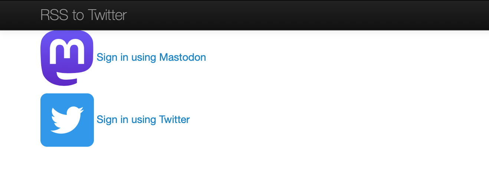
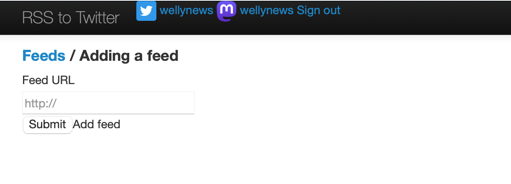
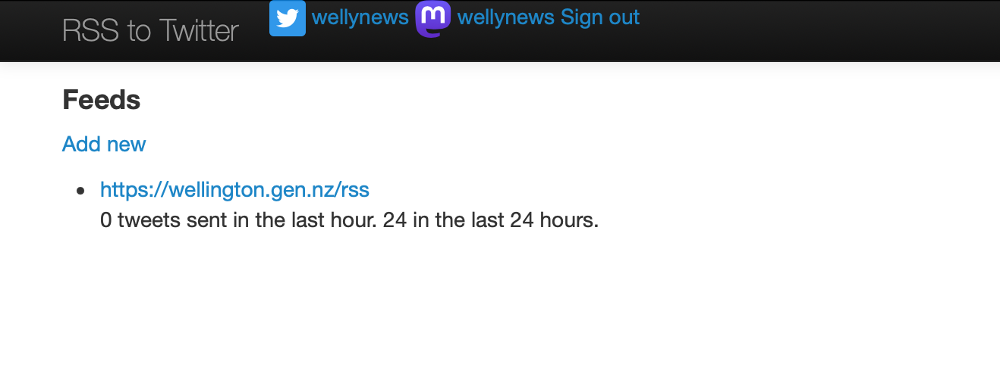
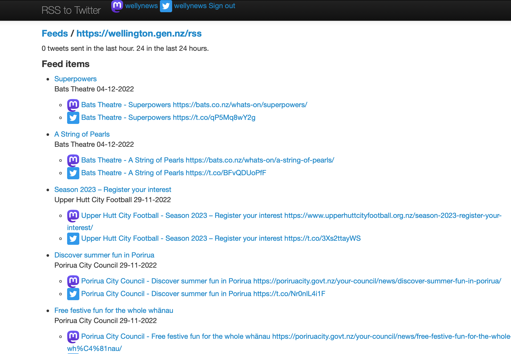

# RSS to Twitter (and Mastodon)

Pushes RSS feed items to linked Twitter accounts.

- Supports multiple input feeds and Twitter accounts.
- Supports rate limiting and duplicate post protection.

Uses MongoDB for storage.
Java / Spring Boot / Maven application intended to be run in a Docker container.

Example output: [@wellynews](https://twitter.com/wellynews)


### Sign in


### Adding a new feed


### Listing feeds


### Feed details



## Run locally

Use Docker to provide a local MongoDB instance:

```
docker-compose -f docker/docker-compose.yml up
```

Inspect the `application.properties` file.

Set the Mongo connection details and your Mastodon and Twitter client credentials.

In the Twitter developer tools, set http://localhost:8080/oauth/callback as an allowed oauth callback url.

Use Spring Boot to start the application locally:
```
mvn spring-boot:run
```

The sign in screen will be visible at http://localhost:8080

## Dependencies

OkHttp for RSS feed fetching.
[Mastodon4j](https://github.com/sys1yagi/mastodon4j) for Mastodon API access.

## Build

Run Maven build then Docker build.
```
mvn clean test install
docker build -t rsstotwitter:latest .
```

